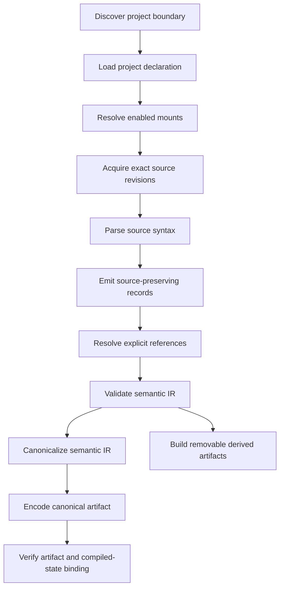
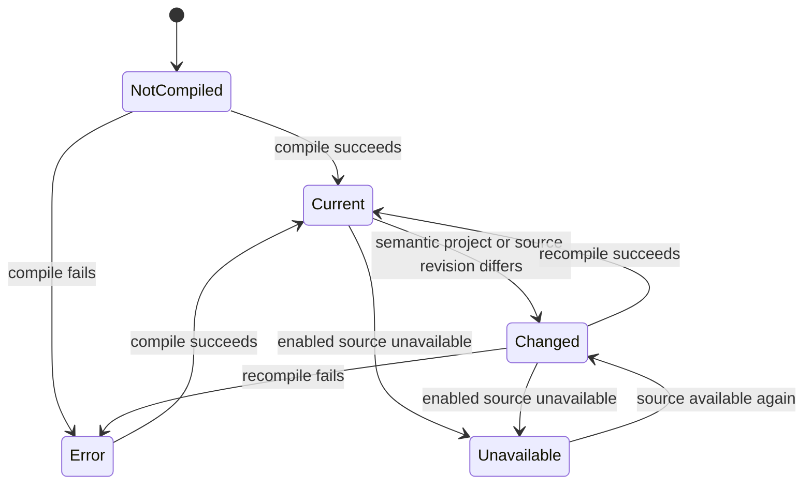

# KERO Compiler Contract

**Status:** accepted through Phase 4  
**Contract version:** `kero/compiler-contract/v1alpha1`

This contract defines compilation layers, deterministic inputs and outputs,
failure behavior, project state, and the authoritative/derived boundary. It
does not select a storage engine. The first semantic, canonicalization, and
encoding versions are specified in `semantic-ir-contract.md`.

## Pipeline



Each stage has typed inputs, outputs, and diagnostics. The CLI is an adapter
over this pipeline and does not own a compiler stage.

## Input contract

Canonical compilation receives an explicit snapshot of:

- project schema and knowledge-set identity;
- the semantic portion of the project declaration;
- enabled mount identities and semantic mount configuration;
- exact logical source identities;
- exact source revisions and their identity-relevant acquisition facts;
- exact source bytes;
- importer identities and versions;
- accepted semantic extension contracts and versions;
- compiler semantic version;
- semantic IR schema version;
- canonicalization algorithm version;
- canonical encoding version.

Display order, UI layout, filesystem modification times, absolute checkout
paths, current time, host name, locale, process ID, random state, cache state,
thread scheduling, and hash-map iteration do not affect canonical bytes.

If a future semantic contract introduces explicit source precedence or another
meaningful order, that accepted semantic field participates in compilation.
Mount display order never gains that meaning implicitly.

## Layer contracts

### Acquisition

Acquisition resolves a mount into exact bytes and acquisition facts. It never
uses a mutable locator as content identity. Unavailable required sources return
structured diagnostics without pretending deletion. Acquisition does not emit
entities or claims.

### Parsing and source preservation

An importer parses one declared source kind and emits source-preserving syntax
records plus explicit semantics supported by that format. Unsupported
semantically significant syntax is an error or a declared opaque record; it is
never silently dropped. Parsing does not perform heuristic entity merging.

### Resolution

Resolution applies explicit identifiers, mappings, and accepted extension
rules. It produces `Reference` records in resolved, unresolved, or ambiguous
states. An optional unresolved or ambiguous reference is valid with a
diagnostic. A required unresolved reference fails validation.

### Semantic validation

Validation operates on semantic IR, not encoded JSON. It enforces type,
identity-domain, reference, provenance, and derivation invariants. It cannot
depend on a database, symbol-table position, or CLI argument layout.

### Canonicalization

Canonicalization transforms valid semantic IR into a deterministic semantic
normal form. It defines meaningful versus meaningless ordering, normalized
values, map ordering, record ordering, and identity serialization. It does not
compress bytes or change meaning.

### Encoding

Encoding converts canonicalized IR into a versioned byte representation. The
first encoding may be inspectable JSON. Symbol tables, compact integers, and
compression are encoding choices. Decoding must reconstruct equivalent
semantic IR without requiring derived indexes.

### Derived construction

Indexes, cached closures, projections, summaries, embeddings, and published
views are derived artifacts. Failure to build an optional derived artifact does
not invalidate an already verified canonical artifact. Required product
operations must report their derived-artifact failure explicitly.

## Determinism

Given byte-identical semantic inputs and identical compiler, importer, IR,
canonicalization, encoding, and extension versions, compilation produces:

1. byte-identical canonical artifacts;
2. identical artifact digests;
3. identical semantic diagnostic codes and ordering;
4. identical compiled-state semantic bindings.

Progress timing, wall-clock duration, local temporary paths, and human display
format are noncanonical and remain outside the canonical artifact.

Canonical record IDs do not use current time, random UUIDs, absolute paths, or
iteration order. An implementation may execute stages concurrently only if the
observable canonical result remains identical.

## Identity participation

Identity algorithms are finalized in later phases, but their domains are fixed:

- knowledge-set IDs come from explicit project identity;
- mount IDs come from reviewable project declarations;
- source IDs are logical and distinct from locators;
- revision IDs include exact content identity;
- region IDs include exact source revision and location;
- explicit semantic IDs may outlive source-region movement;
- anonymous source-local record IDs normally include source-region identity;
- derivation IDs include operation, implementation, version, parameters, and
  identity-relevant inputs.

Encoding-layer symbols and physical storage addresses never participate in
semantic identity.

## Compiled-state binding

A successful installation records a versioned binding between the canonical
artifact and:

- knowledge-set identity;
- semantic project-declaration digest;
- enabled mount identities and semantic configuration;
- represented source IDs and revision IDs;
- compiler/importer/extension versions;
- IR, canonicalization, and encoding versions;
- canonical artifact digest;
- successful diagnostics summary.

This binding enables deterministic status computation. Modification times may
optimize change detection but cannot be the final correctness test.



Disabled is a mount state orthogonal to the overall environment state. A
disabled mount is excluded from the enabled-mount binding while remaining
visible in project state.

## Installation and failure atomicity

Compilation never mutates source material. A canonical artifact and its binding
are written to a new temporary sibling, flushed as required by the selected
storage contract, verified, and atomically installed. A failed or cancelled run
does not replace the last verified artifact or binding.

Compilation fails with stable diagnostics when it encounters:

- invalid project or mount declarations;
- duplicate IDs within an identity domain;
- unavailable required inputs;
- content-identity mismatch;
- unsupported semantically significant syntax;
- invalid required references;
- dangling mandatory semantic references;
- missing explicit provenance;
- invalid or cyclic derivations where cycles are forbidden;
- incompatible mandatory schema or extension versions;
- nondeterministic or noncanonical encoder output;
- output collision with a declared source;
- artifact verification or installation failure.

Optional unresolved references, conflicting claims, unavailable disabled
mounts, and absent optional derived optimizers are not canonical compilation
failures.

## Service boundary

The compiler is a reusable core service. Its request includes project identity,
input snapshot, output intent, limits, and cancellation. It emits structured
progress events, diagnostics, stage results, canonical result identity, and
installation outcome.

It does not read CLI process-global state, print directly, choose UI strings,
or assume a human invoked a complete batch build. CLI, IDE, GUI, CI, watcher,
and future incremental schedulers call the same service.

The initial implementation may recompile the complete knowledge set. Its API
must retain per-mount, per-source, per-revision, importer, and stage boundaries
so future invalidation and partial compilation do not require changing semantic
identity.

## Authoritative and derived state

Authoritative repository-visible state consists of the project declaration and
human-authored sources owned by their natural locations. Authoritative compiled
knowledge consists of verified semantic IR represented by its canonical
artifact and provenance.

The following are derived and removable:

- exact-lookup and relationship indexes;
- cached source observations;
- cached canonicalization intermediates;
- projections and rendered contexts;
- summaries and embeddings;
- published views;
- progress history and performance measurements.

Deleting derived state must not delete mount declarations, source material, or
the only copy of canonical semantic knowledge.

## Versioning

Compiler version, importer version, semantic IR version, canonicalization
version, encoding version, and extension versions are independent. A change in
one does not imply that every other layer changed. The compiled-state binding
records all applicable versions.

Before 1.0, schemas may change without compatibility shims, but fixtures and
documentation change in the same commit and old state fails with an explicit
version diagnostic rather than being silently reinterpreted.

## Phase 4 concrete contracts

The Markdown grammar is `kero/markdown-annotations/v1alpha1`. Annotations are
complete-line HTML comments with quoted UTF-8 attributes:

```markdown
<!-- kero:entity id="sem:service" kind="software:service" -->
<!-- kero:claim id="runtime" subject="sem:service" predicate="software:runtime" value="Rust" -->
<!-- kero:relation id="storage" kind="software:uses" from="sem:service" to="sem:database" -->
```

Entity `id` is required and `kind` is optional. Claims require `subject`,
`predicate`, and `value`; `id` is optional and `polarity` may be `negative`.
Relations require `kind`, `from`, and `to`; `id` is optional. Unknown or
malformed annotations fail. Prose, headings, links, and citation notation are
preserved by the whole-document region but emit no semantics.

Accepted versions are compiler `kero/compiler/v1alpha1`, project
`kero/project/v1alpha1`, annotations `kero/markdown-annotations/v1alpha1`, IR
`kero/semantic-ir/v1alpha1`, canonicalization
`kero/canonicalization/v1alpha1`, encoding `kero/canonical-json/v1alpha1`,
compiled state `kero/compiled-state/v1alpha1`, status
`kero/project-status/v1alpha1`, and CLI envelope
`kero/cli-result/v1alpha1`.

Project hashes are canonical JSON of the validated model under the independent
`kero/project-declaration-hash/v1alpha1` domain, so TOML presentation does not
participate. Progress sequence numbers follow state-machine order;
cancellation is checked between stages and is never serialized.

### Artifact installation and verification

On Unix and Windows, the output and temporary file must be siblings on one
filesystem. KERO writes a newly created hidden sibling, flushes it, renames it
over the destination, then reads and verifies schema, canonical JSON bytes,
semantic canonicality, and payload digest. Failure before rename removes the
temporary file and retains the previous artifact. Filesystems without atomic
same-directory rename replacement are unsupported and surface an installation
error.

The service retains mount, source, revision, importer, and stage boundaries for
future IDE triggers and invalidation. Incremental compilation will require
resumable per-source stage results, but no semantic identity or result-type
redesign. Inspection found no Phase 5 query requirement needing an IR change.

## Phase 2 concrete contracts

`project-source-contract.md` defines the project declaration, logical IDs,
SHA-256 content/revision/region identity inputs, explicit extension tables,
mount mutation behavior, source observations, and symlink containment used by
the compiler input layer.

## Deferred decisions

- Storage engine and binary encoding.
- Watchers, scheduling, incremental invalidation, and partial compilation.
- Query, traversal, projection, and indexing algorithms.

These are assigned to later implementation phases and do not weaken this
contract's layer, determinism, provenance, or failure guarantees.
