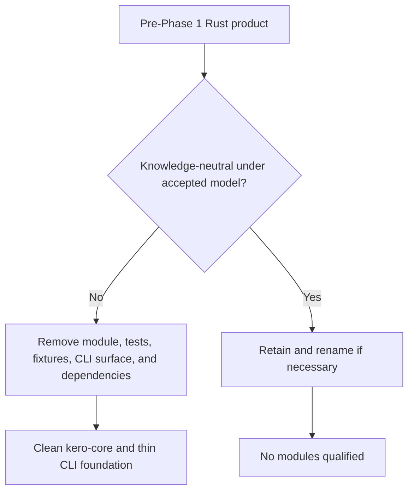

# Phase 1 Discarded-Direction Inventory

**Recorded:** 2026-09-01
**Baseline:** `a2e2747` (`Workflow patch`)
**Disposition rule:** each existing Rust product module is either removed or
retained as a knowledge-neutral primitive. There is no compatibility category.

## Result

No existing Rust product module qualified for retention. The current codebase
was designed around authorization or supported a project/global layout whose
contract created policy and enforcement state. Phase 1 removes that product
implementation and leaves the workspace and package boundary as a clean base
for Phase 2.

## Removed core modules

| Area | Files or module tree | Reason |
| --- | --- | --- |
| Authorization artifacts | `artifact.rs` | Signed decisions and execution bindings belong to the discarded architecture. |
| Execution boundaries | `boundary/` | Bubblewrap, Git push, HTTPS, and workspace-write brokers are not knowledge-system responsibilities. |
| Policy engine | `policy/` | Principals, roles, scopes, delegation, snapshots, and authorization resolution are outside KERO core. |
| Enforcement state | `enforcement/` | Admission, audit, capabilities, deployment evidence, nonce state, recovery, and artifact verification are discarded. |
| Result vocabulary | `result.rs` | Authorization, capability, enforcement, verification, and execution dimensions have no place in the knowledge model. |
| Old layout | `layout.rs` | Initialization and discovery created global and project policy environments; its contract conflicts with project-attached mounts. |
| Old canonical helper | `canonical.rs` | It existed to serialize security artifacts and policy snapshots. Canonicalization returns in Phase 3 under the semantic IR contract. |

## Removed CLI surface

The former policy authorize/replay, artifact verification, workspace write,
Bubblewrap, Git push, HTTPS service, global environment, old project layout,
old knowledge-path, and mixed inspect/setup commands were removed. Their
integration tests and all policy, enforcement, recovery, and boundary fixtures
were removed with them.

The CLI now exposes only package help and version metadata. `kero init`, mount
management, compilation, and status are deliberately reintroduced through the
shared core project/compiler APIs in later phases rather than copied from the
old layout.

## Removed dependencies

`chrono`, `getrandom`, `hex`, `hmac`, `libc`, `serde`, `serde_jcs`,
`serde_json`, `sha2`, `thiserror`, `toml`, and `tempfile` were removed from
`kero-core`. CLI serialization and test dependencies were also removed. Later
phases add only dependencies justified by the accepted knowledge contracts.

## Retained infrastructure

The following are not Rust product modules and remain because they are neutral
construction or publication infrastructure:

- Cargo workspace and crate boundaries;
- the thin Clap CLI package boundary;
- release identity and publication automation;
- Pages and generated-repository builders;
- localization tooling;
- repository topology and publication contracts;
- source and generated-repository CI.

The publication helper named `publish.policy` is release-channel validation,
not a KERO product-policy subsystem.

## Documentation disposition

Public README, Pages, localization, manpage, contribution, and security
templates were rewritten around the project-attached knowledge system. The one
authored pre-alpha release record now identifies its old implementation as a
superseded historical prototype rather than the current product surface.

## Workspace disposition

The workspace `.kero/kero.toml` no longer declares policy paths, and the
workspace policy environment and records were removed. Registered workspace
knowledge now points to the accepted knowledge-system architecture.
