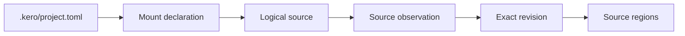

# KERO Project and Source Contract

**Status:** accepted for Phase 2
**Project schema:** `kero/project/v1alpha1`
**Content digest:** `sha256-v1`
**Revision identity:** `source-revision/sha256-v1`
**Region identity:** `source-region/sha256-v1`

This document records the concrete Phase 2 decisions that implement the source
and provenance portion of the semantic and compiler contracts.

## Visible project state

The human-reviewable declaration is `.kero/project.toml`. Its minimal form is:

```toml
schema = "kero/project/v1alpha1"
id = "example.project"
```

A mounted source is declared as:

```toml
[[mounts]]
id = "project-docs"
source_id = "source.project-docs"
source = "docs/guide.md"
kind = "local-file"
media_type = "text/markdown; charset=utf-8"
enabled = true
required = true
display_order = 0
```

The declaration contains intent: project identity and mounts. It contains no
compiler stage, index, partition, storage-engine, or cache configuration.



## Identifier grammar

Knowledge-set, mount, and source IDs:

- contain 1–128 ASCII bytes;
- begin with `a`–`z`;
- contain lowercase letters, digits, dots, and dashes;
- do not contain adjacent separators;
- do not end in a separator.

Examples:

```text
example.project
project-docs
source.rust-reference
```

Filesystem paths, URLs, display names, and content are not logical IDs.

Content digests and source-revision IDs use `sha256:` followed by exactly 64
lowercase hexadecimal digits. Source-region IDs use `region:sha256:` followed
by exactly 64 lowercase hexadecimal digits. Their Rust newtypes are distinct
even when their underlying digest grammar is similar.

## Digest and identity derivation

Content identity is SHA-256 over exact acquired bytes:

```text
content-digest = "sha256:" + lowercase-hex(SHA-256(bytes))
```

Revision identity hashes unambiguously length-prefixed fields in this order:

```text
source-revision/sha256-v1
logical source ID
content digest
media type
sorted acquisition key/value pairs
```

Therefore identical bytes under distinct source IDs share a content digest but
have distinct revision IDs. A locator is not a revision input. Moving a file
while retaining source ID, bytes, media type, and acquisition identity retains
the revision ID. Changing exact bytes changes it.

Region identity hashes length-prefixed `source-region/sha256-v1`, revision ID,
big-endian start and end offsets, and an optional stable local discriminator.
Text ranges are half-open UTF-8 byte ranges. Byte offsets are authoritative;
line and column are derived one-based display coordinates.

## Extension preservation

Unknown fields are rejected everywhere except explicitly declared
`[extensions]` and `[mounts.extensions]` tables. Those tables preserve TOML
values through load/save/load without assigning semantics to them.

This makes extension data reviewable and forward-compatible without allowing a
misspelled mandatory field to disappear into an unvalidated map.

## Mount operations

Core owns add, remove, enable, disable, and reorder operations. CLI, IDE, and
future GUI adapters call these operations rather than implementing their own
configuration mutations.

- Add assigns the next display-order value and rejects duplicate mount IDs,
  duplicate source IDs, and normalized-locator conflicts.
- Remove returns the removed mount and compacts display order.
- Enable/disable changes participation state without deleting the mount.
- Reorder changes only contiguous display-order values.
- Reorder never changes mount ID, source ID, source revision, or precedence.
- Save validates, orders mounts by display order, writes a temporary sibling,
  flushes it, and replaces the declaration.

Normalized locator comparison removes `.` and resolves lexical `..` segments
without treating the resulting locator as source identity.

## Project discovery and symlinks

Discovery starts from an explicit file or directory, walks lexical parents,
and returns the nearest `.kero/` directory. A nested project wins. The `.kero/`
entry itself must be a directory and must not be a symlink. Its canonical
parent must be the canonical selected project root.

Local acquisition resolves a declared absolute or project-relative locator
lexically, then checks every existing path component with symlink-aware
metadata. Any symlink component fails with `source.locator-symlink`. Explicit
`../shared` locators are allowed, but their traversed components still cannot
be symlinks. Future directory acquisition must apply the same rule to every
entry it traverses.

## Source kinds

Phase 2 declares these kinds:

- `local-file` — acquired now;
- `structured-json` — acquired as exact bytes now, parsed semantically later;
- `local-directory` — represented, directory expansion deferred;
- `git-repository` — represented, acquisition deferred;
- `remote-snapshot` — represented, network acquisition deferred;
- `kero-set` — represented, nested-set import deferred;
- `opaque` — deliberately preserved without invented semantics.

Kinds without a Phase 2 acquirer produce an `unsupported` opaque observation
and stable diagnostic rather than disappearing.

## Source observations

Observations preserve the declaration and report one state:

- `current`: exact bytes were acquired and revision identity computed;
- `disabled`: mount exists but does not participate;
- `unavailable`: an enabled local source cannot currently be acquired;
- `unsupported`: declaration is preserved but no Phase 2 acquirer exists.

An unavailable observation is not deletion. It retains source ID, mount ID,
locator, kind, media type, display order, and acquisition metadata. These facts,
plus enabled mount state and revision IDs, are sufficient for Phase 4 to compare
current observations with compiled-state bindings.

## Diagnostic codes

Phase 2 exposes stable codes including:

```text
knowledge.id.invalid
project.not-found
project.boundary-symlink
project.boundary-escape
project.declaration-invalid
project.schema-unsupported
project.mount-duplicate
project.source-duplicate
project.mount-locator-conflict
project.display-order-duplicate
project.display-order-gap
project.mount-not-found
source.unavailable
source.kind-unsupported
source.locator-symlink
source.locator-not-file
source.digest-mismatch
source.region-bounds
source.region-utf8-boundary
```

Diagnostics carry severity, message, optional source ID, and optional region
ID. Stable codes—not human message text—are the machine contract.

## Phase 3 readiness

The region model is sufficient for Phase 3 claims: it binds exact revision and
UTF-8 byte range, supplies derived display coordinates, supports an optional
local discriminator, and participates in validated provenance. Phase 3 can add
semantic-record identity without changing source, revision, or region identity.
