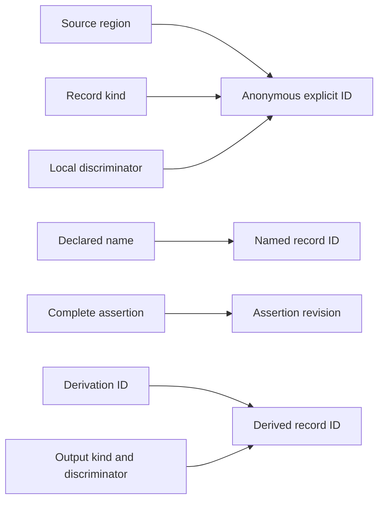
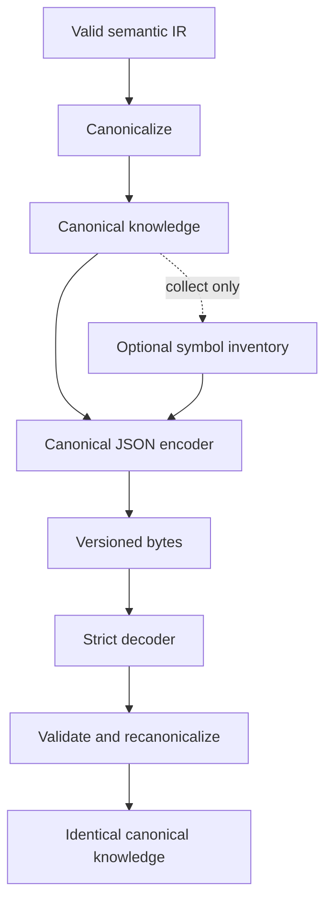

# KERO Semantic IR and Canonical JSON Contract

**Status:** accepted for Phase 3  
**Semantic IR:** `kero/semantic-ir/v1alpha1`  
**Canonicalization:** `kero/canonicalization/v1alpha1`  
**Encoding:** `kero/canonical-json/v1alpha1`

This contract fixes the first implemented semantic representation. Rust layout
and JSON field names are not themselves semantic. KERO is pre-1.0, so later
corrections advance the affected version instead of silently changing it.

## Identity

Entity IDs are `sem:<logical-id>`. Named record IDs are
`record:<logical-id>`. Anonymous record IDs are
`record:sha256:<64 lowercase hex>`, and derivations use
`derivation:sha256:<64 lowercase hex>`. Logical IDs begin with lowercase ASCII,
contain lowercase ASCII, digits, dots, or dashes, contain no adjacent or
trailing separators, and are at most 128 bytes.

Kinds and predicates contain exactly two lowercase symbolic components joined
by `:`, such as `core:contained-by`. They are open, namespaced symbols rather
than a closed Rust enumeration.

Named claims and relations retain identity when moved between regions. Their
separate `assertion_revision` hashes the complete assertion, so changed meaning
remains visible. Anonymous explicit IDs hash the region, record kind, and local
discriminator. Derived record IDs hash the derivation, output kind, and output
discriminator.

Hashes use SHA-256 with length-framed domain and value bytes:

| Identity | Domain | Ordered fields |
| --- | --- | --- |
| Anonymous explicit | `semantic-explicit/sha256-v1` | region, kind, discriminator |
| Assertion revision | `semantic-assertion/sha256-v1` | complete typed assertion |
| Derivation | `semantic-derivation/sha256-v1` | input order and IDs, kind, implementation, version, parameters |
| Derived record | `semantic-derived-record/sha256-v1` | derivation, output kind, discriminator |

## Records and origins

The IR contains a region registry binding every source-region ID to its exact
source and revision, plus entities, references, claims, relations, and
derivations. Every explicit object has nonempty provenance matching that full
registered binding. Every derived record names a registered derivation.
Derivations name existing inputs and outputs and must form an acyclic graph.

Claims preserve subject, namespaced predicate, typed value, polarity, origin,
and assertion revision. Positive and negative claims coexist; there is no
global truth or preferred-source field. Agreement, contradiction,
supersession, explanation, and containment remain independent records.

Relation endpoints are entities or semantic records. Direction is meaningful;
symmetry, inverse, and transitivity are never implied. Unknown valid
namespaced relation kinds round-trip unchanged.

References preserve surface syntax, requiredness, origin, and state.
Unresolved references have no candidates and are valid only when optional.
Resolved references have one existing entity target and nonempty explicit
evidence. Ambiguous references have at least two existing candidates, each
with evidence. Candidate and evidence order is nonsemantic. Heuristic
resolution is a derivation and cannot rewrite explicit evidence.

## Values

Values are tagged: null, Boolean, signed 64-bit integer, normalized decimal
string, text, entity reference, ordered list, map, or opaque extension. Equality
is tag-aware, so text `"5"`, integer `5`, and decimal `"5"` differ. Decimals
have no plus sign, exponent, redundant leading zero, trailing decimal point,
trailing fractional zero, or negative zero. Lists are ordered. Map keys are
unique Unicode strings and map order is not semantic. Opaque values declare a
kind, version, and uninterpreted string payload.

## Canonicalization and ordering

Canonicalization validates first, sorts top-level collections by typed ID,
sorts provenance and evidence by canonical representation, sorts ambiguous
candidates by target, sorts explicitly unordered derivation inputs, and sorts
derivation outputs. It preserves list order and explicitly ordered derivation
inputs. Maps use lexical key order. Mount display order, time, absolute paths,
locale, filesystem metadata, host state, and map iteration never participate.

## Canonical JSON

The encoding is one compact UTF-8 JSON object followed by one newline. The
envelope contains encoding schema, canonicalization version, optional symbol
inventory, and canonical knowledge. The symbol inventory is sorted and unique;
the payload never addresses it by position, so decoding with or without it
produces identical semantic IR.

The decoder rejects malformed JSON, unsupported mandatory versions, invalid
symbol inventories, duplicate IDs, dangling references, semantic failures,
noncanonical order, and bytes differing from a fresh encoding. Thus
encode/decode/encode is byte-identical.

