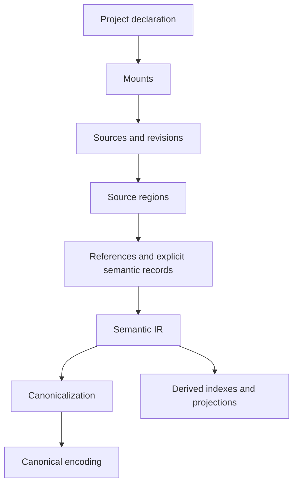

# KERO Semantic Model

**Status:** accepted through Phase 3
**Contract version:** `kero/semantic-model/v1alpha1`

This document defines KERO's initial semantic vocabulary independently of any
Rust layout, database, encoding, CLI, IDE, or GUI. Later phases may revise this
pre-1.0 contract, but implementations must not silently diverge from it.

Concrete Phase 3 identity, normalization, canonicalization, and encoding rules
are specified in `semantic-ir-contract.md`.

## Product boundary

KERO is a persistent knowledge environment attached to a project. A `.kero/`
directory identifies the project boundary. Humans attach and manage knowledge
sources through mounts; KERO compiles those sources into provenance-preserving
semantic knowledge.

Authorization, permissions, policy evaluation, command execution, sandboxing,
and operation enforcement are outside this model.

## Terms

- **Project:** the repository or directory tree attached to one `.kero/`
  boundary.
- **Knowledge set:** the semantic compilation boundary represented by one KERO
  project and its participating enabled mounts.
- **Mount:** a project declaration that makes an external or project-local
  source available to the knowledge set.
- **Source:** one logically identified input obtained through a mount.
- **Provenance:** the trace from semantic knowledge to exact source material or
  an explicit derivation.
- **Explicit:** directly declared by source syntax or an author annotation.
- **Derived:** produced from identified inputs by a recorded transformation.
- **Inferred:** derived through a heuristic or model rather than a mechanical
  semantics-preserving transformation.
- **Semantic IR:** the typed in-memory meaning of sources, references,
  entities, claims, values, relations, and derivations.
- **Canonicalization:** deterministic normalization and ordering of valid
  semantic IR.
- **Canonical encoding:** bytes representing canonicalized semantic IR.
- **Projection:** a bounded, derived selection of semantic knowledge for a
  consumer.
- **Semantic normalization:** conversion of equivalent semantics into an
  accepted normal form.
- **Structural compression:** removal of representational repetition without
  loss of semantic information.
- **Byte compression:** reversible compression of encoded bytes.
- **Lossy derived summarization:** a derived reduction that may omit detail and
  therefore cannot replace canonical knowledge.

## Layer boundaries

Mounts are project-facing. Sources and regions are provenance-facing.
Semantic IR is meaning-facing. Canonicalization is determinism-facing.
Encoding is storage-facing.

## Project discovery

Discovery accepts an explicit starting path. If it is a file, discovery begins
at its parent directory. It then examines that directory and each lexical
parent for a `.kero/` directory and stops at the nearest match. Reaching the
filesystem root without a match returns `project-not-found`.

A nested `.kero/` boundary defines a nested project and prevents accidental
inheritance from an outer project. Discovery does not follow a symlink merely
to search outside the lexical ancestor chain. Before reading project state, an
implementation resolves the selected `.kero/` boundary and rejects a boundary
whose resolved location escapes the selected project directory.

Discovery produces project location, not semantic identity. Moving a project
does not by itself rewrite declared semantic IDs.

## Mount model

A mount has:

- a stable project-local mount ID;
- a human-reviewable locator;
- an optional importer hint or declared source kind;
- an enabled flag;
- display-order metadata;
- extension data allowed by the project schema.

Mount locators may describe files, directories, repositories, pinned remote
resources, structured sources, or other KERO sets. A mount does not imply that
source bytes are copied beneath `.kero/`.

Mount display order has no semantic precedence. Enabling, disabling, adding,
removing, and reordering mounts are project operations shared by all adapters.
Important mount declarations must exist in reviewable project configuration,
not only in opaque state.

## Semantic objects

### KnowledgeSet

`KnowledgeSet` identifies the compilation boundary. Its identity is explicitly
declared by the project. Equality uses the validated knowledge-set ID, not the
project path. Serialization includes its schema and ID. Its provenance is the
project declaration. An empty or invalid ID, duplicate ID within one compiled
environment, or incompatible schema is invalid.

### Source

`Source` identifies one logical input. It records a source ID, owning mount,
kind, logical locator, media type, acquisition facts, and current revision.
Equality uses the source ID within its knowledge-set identity domain. The
locator is provenance metadata, not semantic identity. Serialization preserves
all declared acquisition facts and allowed extension data. A missing owning
mount, duplicate source ID, or locator incompatible with its source kind is
invalid.

### SourceRevision

`SourceRevision` identifies exact acquired source content plus the acquisition
facts declared identity-relevant by that source kind. Its identity changes
whenever exact source bytes change. Equality uses the revision ID. Serialization
includes source ID, content digest, acquisition identity, and media type. A
digest mismatch, reference to another source, or unavailable required identity
fact is invalid.

### SourceRegion

`SourceRegion` identifies an exact region within one source revision. For UTF-8
text, authoritative coordinates are a half-open byte range; line and column are
derived display coordinates. Equality uses revision ID, region kind, byte
range, and an optional stable local discriminator. Serialization includes the
revision binding and coordinates. An out-of-bounds range, non-boundary UTF-8
offset where text boundaries are required, inverted range, or revision mismatch
is invalid.

Changing bytes before a region normally changes region identity because its
coordinates changed. This does not automatically change explicitly declared
semantic identity inside the region.

### Entity

`Entity` is an explicitly identified subject about which claims can be made.
Its semantic ID is independent of source position. Equality is exact validated
semantic-ID equality; names and textual similarity never establish equality.
Serialization includes its ID, declared kind if present, explicit provenance,
and allowed extension data. Conflicting definitions do not invalidate the
entity, but duplicate incompatible declarations using the same explicit ID must
remain visible as a conflict diagnostic rather than silently overwrite one
another.

### Reference

`Reference` preserves source-local syntax that appears to refer to a semantic
object. It has its own semantic-record ID, source region, surface form or
structured target, required flag, and one of these states:

- `unresolved`: no explicit target is established;
- `resolved`: exactly one target is established by explicit evidence;
- `ambiguous`: multiple explicit candidates remain.

References are first-class semantic records. Equality uses their record IDs;
similar text does not make references equal. Serialization preserves the state,
candidates, and evidence. A resolved reference without exactly one target, an
ambiguous reference with fewer than two candidates, or a target without
evidence is invalid.

An unresolved or ambiguous optional reference is valid knowledge accompanied
by a diagnostic. An unresolved required reference is a compilation error.
Heuristic or model-generated resolution is a derivation and cannot rewrite the
explicit reference.

### Claim

`Claim` is a source-attributed assertion. It contains a semantic-record ID,
subject entity, predicate, value, polarity, provenance, and origin kind
(`explicit` or `derived`). Equality uses record ID; two claims with equal
contents from different sources remain distinct. Serialization preserves the
complete assertion and origin. Missing subject, predicate, value, or provenance
is invalid.

A claim does not contain a global truth field. Contradiction and agreement are
relationships between independently preserved claims.

### Value

`Value` is a typed scalar, entity reference, ordered list, unordered map with
defined key semantics, or declared opaque extension value. Equality is
type-aware: textual `"5"` and numeric `5` are not equal. Serialization uses a
tagged representation. Non-finite numbers, duplicate normalized map keys, an
unknown mandatory value type, or a dangling mandatory entity reference is
invalid.

### Relation

`Relation` is a typed, directed connection between semantic objects. Relation
kinds are validated namespaced identifiers rather than a closed universal
enumeration. Equality uses semantic-record ID. Serialization includes kind,
endpoints, origin, and provenance. Missing endpoints, invalid kinds, or
provenance-free explicit relations are invalid.

Direction reversal is not implied. Symmetry, transitivity, or inverse behavior
exists only when explicitly declared by a relation extension contract.

### Derivation

`Derivation` records how non-explicit knowledge was produced. It contains a
derivation ID, ordered or explicitly unordered input IDs, operation kind,
implementation identity, implementation version, parameters, and output IDs.
Equality uses derivation ID. Serialization preserves every identity-relevant
input. Missing inputs, undeclared implementation/version, invalid parameters,
or forbidden dependency cycles are invalid.

Inference is a derivation kind. Its output remains distinguishable from
explicit knowledge and cannot replace its inputs.

## Identity domains

| Domain | Stable across file move | Stable across byte change | Stable across region move | Basis |
| --- | --- | --- | --- | --- |
| Knowledge set | Yes | Yes | Yes | Explicit project declaration |
| Mount | Yes when locator is edited in place | Yes | Yes | Project-local declared ID |
| Source | Yes when declared identity is retained | Yes | Yes | Logical source ID |
| Source revision | Yes for identical identity facts | No | No when bytes change | Content plus acquisition identity |
| Source region | Only if same revision and coordinates | No | No | Revision plus exact region |
| Semantic entity | Yes | Yes when explicitly named | Yes | Explicit semantic ID |
| Semantic record | Depends on record class | Usually no for anonymous explicit records | Usually no | Defined record identity inputs |
| Derivation | Yes when all identity inputs match | No when an input identity changes | Depends on inputs | Operation, version, parameters, inputs |

An anonymous source-local claim normally changes record identity when its
defining region changes. An explicitly named entity does not. An explicitly
named claim may retain identity across a move only when the author supplied a
stable ID and its changed assertion remains represented as a changed revision,
not silently treated as identical content.

## Provenance requirements

Every explicit semantic record references at least one exact source region.
Every derived semantic record references one derivation. Every derivation
references semantic records or source regions that ultimately lead to source
revisions. A consumer can therefore trace any claim without consulting an
index, summary, or UI-private state.

## Compilation-state facts

Core project state must expose deterministic facts sufficient for adapters to
render these concepts:

- `current`: enabled mounted source revisions exactly match the successful
  compiled-state binding;
- `changed`: project declaration or an enabled mounted source revision differs
  from that binding;
- `not-compiled`: no successful compiled-state binding exists;
- `error`: the most recent required compilation attempt failed, with stable
  diagnostics;
- `disabled`: a mount is declared but excluded from compilation;
- `unavailable`: an enabled mount cannot currently provide its required source.

These are semantic project-state concepts, not timestamp interpretations.

## Worked examples

### Agreement across sources

Source `rust-book` and source `project-guide` explicitly reference entity
`rust.ownership`. Each emits its own claim that ownership governs resource
lifetime. The claims remain separate because provenance differs. An explicit
`agrees-with` relation may connect them; equal normalized values alone do not
erase either claim.

### Contradiction across sources

Source `spec-a` claims entity `system.retry-limit` has numeric value `5`.
Source `spec-b` claims the same explicitly identified entity has numeric value
`7`. Both claims compile. An explicit or derived `contradicts` relation may
connect them. KERO does not choose `5` or `7`, and mount display order does not
change the result.

### Unresolved reference across sources

Source `notes` contains the reference text `Rust`; source `language-index`
declares entities `language.rust` and `game.rust`. Without explicit evidence,
the reference is `ambiguous` with two candidates. It is preserved with its
source region and diagnostic. A later author annotation can resolve it to
`language.rust`; a future model may propose the same resolution only as derived
knowledge with its own provenance.

## Phase 2 concrete contracts

The Phase 2 project, mount, source, identifier, digest, extension, acquisition,
and region contracts are defined in `project-source-contract.md`. That contract
selects `.kero/project.toml`, `kero/project/v1alpha1`, the initial logical-ID
grammar, SHA-256-based revision and region identities, explicit extension
tables, and no-symlink local acquisition.

## Open questions deferred beyond Phase 2

- Exact Rust module layout and serialized field names.
- Markdown annotation syntax.
- Canonical JSON schema.
- Storage engine, binary encoding, partitioning, and indexes.
- Watcher implementation and incremental compilation algorithm.

These questions do not change the accepted semantic boundaries and are routed
to their assigned later phases.
